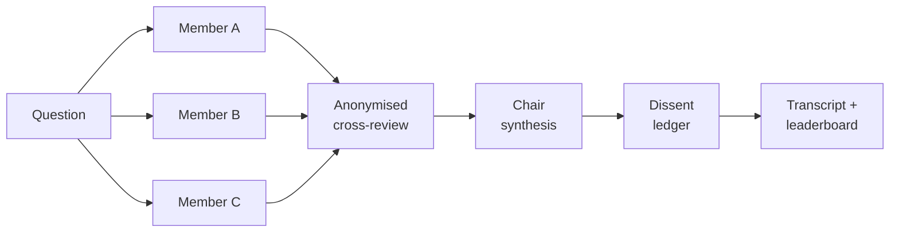

# llm-roundtable

Ask a council of LLMs a question instead of just one, and read where they actually disagreed.



## The idea

A single prompt to a single model gives you one voice with one set of blind spots, stated
confidently either way. Ask three models the same question independently, and you get three
attempts, which is already useful, but the interesting part is not the three answers. It is
what happens when you make the models grade each other's work without knowing whose it is,
then hand a chair model everything (the answers and the grading) and ask it to write the
final call.

Two design choices carry most of the value. First, the peer review is anonymised: each
reviewer sees "Response A / B / C" with a private shuffle, never a model name, so a model
cannot recognise and favour its own answer or defer to a bigger name. Second, and this is
the part I actually read when a run finishes: a dissent ledger. Most council setups stop at
the synthesised answer. That throws away the most useful signal, which is where the members
did not agree. The ledger names the claim in dispute, both positions, which one was the
minority view, what evidence would settle it, and what the chair did about it. A confident
final paragraph tells you what to think. A dissent ledger tells you where to be careful.

This is a test version and an idea file, not a product. It has no auth, no persistence
beyond flat files, and no guardrails against a member ignoring the format it was asked to
use (the parser is built to survive that, see the design notes below, but it will not save
you from a genuinely bad prompt). I built and ran it to see whether the ledger idea was
worth the plumbing. It was.

## What happens when you ask

1. **Stage 1, first opinions.** Every configured member answers the question independently
   and in parallel (`asyncio.gather`). No member sees another's answer at this point.
2. **Stage 2, anonymised peer review.** Each member reviews the *other* members' answers.
   Identities are hidden behind a private, per-reviewer label shuffle (Response A, B, C),
   different for every reviewer, so no model can learn "I am always B." Each reviewer scores
   every other response on the configured rubric (accuracy, insight, completeness by
   default) and gives an overall ranking with a one-line reason.
3. **Stage 3, chair synthesis.** One designated member, the chair, reads the question, every
   first opinion (by real name at this point), and every peer review, and writes the final
   answer.
4. **Stage 4, the dissent ledger.** The chair looks back over any real disagreements (using
   a second, separate anonymisation scheme, "Member 1 / Member 2", so the written record
   stays neutral) and records: the claim in dispute, each side's position, the minority
   view, what would settle it, and what the chair actually did about it in the final answer.
   Skipped automatically if the members substantially agreed.
5. **Write and score.** The whole run is saved as a readable markdown transcript plus a JSON
   sidecar (`runs/YYYY-MM-DD-HHMM-<slug>.{md,json}`), and `leaderboard.json` folds this run's
   peer rankings into a running mean rank position per model, across every run you have made.

With one member, stages 2 and 4 are skipped: there is nothing to review or dissent from,
and you get a plain single-model answer through the same pipeline.

## Quick start

Prerequisites: [uv](https://docs.astral.sh/uv/), Python 3.12 (uv will fetch it if you do not
have it), and at least one of: an Anthropic key, an OpenAI key, an OpenRouter key, a local
Ollama install, or Claude Code installed and logged in (the zero-key path, see below).

```bash
git clone https://github.com/Jiplet/llm-roundtable.git
cd llm-roundtable
uv sync

cp .env.example .env                        # fill in whichever provider keys you actually have
cp council.yaml.example council.yaml         # edit `members:` to match what you filled in

# No keys needed yet: runs the whole pipeline against a deterministic fake provider
uv run roundtable ask "Should a small team adopt a monorepo?" --dry-run

# The real thing, using whatever you configured in council.yaml
uv run roundtable ask "Should a small team adopt a monorepo?"

uv run roundtable leaderboard
uv run roundtable show runs/<the-file-it-just-wrote>.md
```

A successful `ask` prints which members and chair it is using, where it wrote the
transcript and sidecar, a token (and cost, where the provider reports one) summary, and
then the final synthesised answer. `uv run pytest -q` runs the test suite (fake provider
only, no network, no keys).

**The zero-key path.** If you have [Claude Code](https://claude.com/claude-code) installed
and are logged in, set a member's `provider` to `claude_cli` and `model` to `haiku`,
`sonnet`, or `opus`. It shells out to the `claude` CLI, billed to whatever session you are
logged into rather than a metered API key, so a whole council can run with nothing in
`.env` at all. See the design notes below for the real trade-offs this path carries: it is
not free of cost or of quirks, just free of needing a key.

## An abridged real transcript excerpt

From the smoke run in `examples/real-run-transcript.md` (two Claude models over the
`claude_cli` provider, question: the strongest arguments for and against a four-day work
week for a field-services company). This is stage 4, the part worth reading first:

> **Claim in dispute:** Does moving to a four-day schedule inherently cut billable/revenue
> capacity, or does it depend on which four-day model is used?
> - **Member 1's position:** treats capacity loss as a flat structural con, arguing "you
>   can't compress 8 hours of physical work into 6."
> - **Member 2's position:** argues the answer depends on format: a compressed 4x10
>   schedule could preserve or even increase capacity, while only a true 32-hour week
>   necessarily cuts billable hours.
> - **Minority position:** Member 1's undifferentiated framing.
> - **What would settle it:** before/after data from field-services companies comparing
>   jobs-completed-per-technician and revenue per truck under a true 32-hour week versus a
>   4x10 compressed week.
> - **Chair's decision:** adopted Member 2's finer-grained framing; the "4x10 vs. true
>   32-hour week" split became the organising crux of the final synthesis, since it resolves
>   the dispute rather than picking a side.

## What's here

| Path | What it is | When you touch it |
|---|---|---|
| `roundtable/providers/*.py` | One file per LLM backend, all implementing the same `complete()` shape | Adding a new backend |
| `roundtable/council.py` | The four-stage pipeline: prompts, parsing, orchestration | Changing how a stage works |
| `roundtable/lenses.py` | Loads a lens file as a system-prompt preamble | Rarely |
| `roundtable/transcript.py` | Writes the markdown/JSON run output and updates the leaderboard | Changing the output format |
| `roundtable/cli.py` | The `roundtable` command | Adding a flag |
| `council.yaml.example` | Template config: members, chair, rubric, lens dir | Copy to `council.yaml`, then edit whenever your member list changes |
| `lenses/*.md` | Three short original lenses (CFO, operator, sceptic) | Add your own, one file per lens |
| `examples/*.md` `.json` | A dry-run transcript and a real smoke-run transcript | Reference only |
| `tests/*.py` | pytest suite: fake provider end to end, `claude_cli` argv via a monkeypatched subprocess. No network. | When changing `council.py` or a provider |
| `.env.example` | Key template | Copy to `.env`, fill in what you use |
| `Makefile` | `make test` / `dry-run` / `ask Q="..."` / `leaderboard` | Rarely |

## Adapting it to your setup

**Add a provider.** Copy `roundtable/providers/openrouter.py`, the shortest one: read a key
from the environment, build a request in the provider's shape, return `Completion(text,
Usage(...))`. Register the class in `roundtable/providers/__init__.py`'s `_REGISTRY` dict
under whatever string you want `provider:` to say in `council.yaml`. That is the whole
interface; `council.py` never imports a provider module directly.

**Use only local Ollama models.** Set every member's `provider` to `ollama` and `model` to
whatever you have pulled (`ollama pull llama3.1`, `ollama pull mistral`, and so on). Costs
nothing, needs `ollama serve` running.

**Use lenses.** `uv run roundtable ask "..." --lenses cfo,operator,sceptic` assigns lens
files to members positionally, one lens per member in the order they appear in
`council.yaml` (or in `--members`, if you passed that too). Write your own lens as a short
markdown file in `lenses/`: what it always asks, what it distrusts, how it wants the answer
shaped. See the three shipped here for the shape; `exec-council` (linked below) has twelve
more, aimed at executive review rather than a general-purpose council.

**Change the rubric.** Edit `review_rubric:` in `council.yaml`. The review prompt and the
parser are both built from that list at runtime, not hardcoded to three dimensions, so
adding or renaming a dimension needs no code change.

## Design notes

**Per-reviewer shuffle, not one global shuffle, for stage 2.** If every reviewer saw the
same "A is Claude, B is GPT" mapping, a model with a strong prior about another model's
house style could still infer authorship from the label alone, once it has seen a few runs.
A private shuffle per reviewer, generated fresh for every review, closes that off cheaply.
The dissent ledger in stage 4 deliberately uses a *different, single, non-shuffled* scheme
("Member 1 / Member 2") instead of reusing stage 2's labels: it is a different kind of
anonymisation, applied for a different reason (a neutral written record, not review-time
bias reduction), and reusing the same letters across both would have made two unrelated
schemes look like one, which is worse than either alone.

**Parsing rankings robustly.** A reviewer is asked to use a specific `## Response X` /
`RANKING:` format, and most of the time it does. When it does not, `parse_review()` falls
back in order: derive a ranking from the summed rubric scores if `RANKING:` is missing or
incomplete; failing that, hunt for any `A > B`-shaped fragment anywhere in the text; failing
that, fall back to presentation order. Every fallback path still returns a complete,
valid ranking rather than raising, and sets `fallback_used=True` so a caller (or a reader of
the transcript) knows to trust it less. See `tests/test_ranking_parse.py` for well-formed
and deliberately sloppy inputs against this.

**Cost shape.** N members costs N first-opinion calls, plus N review calls (each reviewer
scores the others in one call), plus 2 chair calls (synthesis, dissent), so `2N + 2` calls
total for N members. Three members is 8 calls, not 3.

**Why the leaderboard is by mean rank position, not by win count.** A raw win count rewards
a model for showing up in easy comparisons and says nothing about how it did when it lost.
Mean rank position (1 = always ranked best across every review it appeared in) is comparable
across models reviewed a different number of times, and a model that is consistently ranked
second across a lot of reviews should show up as clearly better than one that wins once and
is never reviewed again.

**What the small models did in the smoke run, honestly.** The API keys in the build
environment had no credit that night (both Anthropic and OpenAI returned "insufficient
credit" errors on a trivial call), so the smoke run in `examples/` used two Claude models
through the `claude_cli` provider instead of the intended Anthropic-plus-OpenAI mix. That
path is real and it worked, but it is not free of trade-offs, and it needed one real fix
mid-build:

- **A context leak was found, and fixed, not just documented.** The subprocess runs from a
  neutral temp directory and gets a fully custom `--system-prompt`, on the assumption that
  would keep an answer clean. It did not: the first version of this provider had the
  `sonnet` member's stage 1 answer say "given your context" and cite Australian employment
  law ("Fair Work") unprompted, on a question that never mentioned a jurisdiction, because
  neither a custom system prompt nor a neutral cwd stops the CLI from loading the logged-in
  account's own settings (global CLAUDE.md, memory, project context). `--bare` mode would
  prevent this but requires `ANTHROPIC_API_KEY`, which was exactly the thing unavailable
  that night. The actual fix is `--setting-sources ""`, which tells the CLI to load no
  settings at all, and it is in `claude_cli.py` now: `test_claude_cli_provider.py` asserts
  the flag is on every call's argv, and the re-run smoke transcript in `examples/` has no
  trace of the leak. Verify it yourself with `claude -p "Where do I live?" --setting-sources
  ""` versus without.
- **Fixed cost per call is real and non-trivial.** A single tiny "say OK" call through the
  CLI cost around $0.01 to $0.05 depending on flags, almost entirely the harness's own
  context (tool definitions, default system prompt), not the actual question. `--allowedTools
  ""` plus `--strict-mcp-config` (stripping the tool set a coding session would normally
  carry, which a roundtable member answering a question has no business holding anyway) cut
  that overhead by roughly 4x in testing. The full smoke run (2 members, 6 calls) still came
  to $0.44 and about 214k tokens, dominated by that fixed overhead repeated per call, not by
  the four-day-week question itself.
- **The tolerant ranking parser earned its place on the first real run.** `haiku`'s stage 2
  review did not follow the requested `## Response X` / `RANKING:` format at all; the parser
  fell back gracefully and the transcript records `fallback_used` for that review rather than
  crashing the run or silently inventing a ranking that looked structured when it was not.
  See `examples/real-run-transcript.md`, haiku's review, for the actual output.
- **The "never use an em dash" style instruction, added to every stage's system prompt,
  mostly worked but not completely.** Two em dashes still made it into the real smoke run's
  raw output (both from `haiku`) and were hand-corrected before shipping the example
  transcript in this repo. Style instructions in a system prompt are a nudge, not a
  guarantee.
- **Two members is the minimum interesting case, not a good demonstration of stage 2.** With
  only two members, each reviewer has exactly one other response to rank, so the "ranking"
  in the example transcript is trivially a single item. The anonymised peer review only
  starts to show its value with three or more members genuinely disagreeing.
- **`anthropic`, `openai`, `openrouter`, and `ollama` were unit-tested against the fake
  provider (`tests/test_providers_select.py` and the council end-to-end tests) but never
  exercised against a live network call in this repo's own examples.** The retry logic in
  `openai.py` for the `max_tokens` / `max_completion_tokens` and temperature quirks on newer
  reasoning models is based on documented API behaviour, not a live test against those
  specific failure modes, since the smoke budget went to the CLI path instead.

## Limitations and non-goals

- No retries beyond the two documented OpenAI parameter fallbacks; a transient network
  failure fails the whole run.
- No persistence beyond flat files (`runs/`, `leaderboard.json`); no database, no web UI.
- The dissent ledger is always chair-authored in this version, not a separately designated
  member, even though the underlying idea supports either.
- `claude_cli` does not expose sampling temperature or an output-length cap; both
  parameters are accepted (to satisfy the shared interface) and silently ignored for that
  provider.
- The tolerant ranking parser is a feature, but it means a genuinely malformed review can
  still produce a plausible-looking, wrong ranking rather than a loud failure. Always check
  `fallback_used` before trusting a review you have not read yourself.
- Not built for adversarial or red-team prompts. Providers other than `claude_cli` make
  plain completion calls with no tool access at all; `claude_cli` explicitly strips tool
  access with `--allowedTools ""`, but this is not a sandboxing claim.

## FAQ

**Why not just ask one strong model to role-play multiple personas?** Independent sampling
plus a genuine anonymised cross-review catches things a single context window smooths over:
a model that has already committed to a framing in its own "voice one" answer will tend to
keep that framing consistent across personas, whereas a truly separate call starts fresh.
Lens mode (see above) gives distinct vantage points without pretending that is the same
thing as separate models.

**Does the leaderboard mean anything after one or two runs?** No. It is a running counter,
not a validated benchmark. Treat single-digit run counts as noise; the point is what it
looks like after fifty questions, not five.

**Can members and the chair be the same underlying model?** Yes, and the shipped smoke run
does exactly that (two Claude models, one as chair). You still get independent sampling and
genuine peer review, just not vendor diversity. Mixed-vendor councils are the intended
shape; same-vendor is a valid, cheaper starting point.

**What happens if a review response does not parse?** See "parsing rankings robustly"
above. It falls back gracefully and flags `fallback_used=True` in both the transcript and
the JSON sidecar rather than crashing the run.

**Is this safe to point at an untrusted or sensitive question?** Nothing here is designed
for that. Providers other than `claude_cli` are plain text-in, text-out API calls; treat
whatever you send exactly as you would a direct API call to that vendor.

## Related

The three-stage council pattern was popularised by Andrej Karpathy's llm-council; this is
an independent, CLI-first take with a dissent ledger and a peer leaderboard, built to run on
whatever keys you already have. For more role lenses see github.com/Jiplet/exec-council.

## Licence

MIT, see `LICENSE`.
